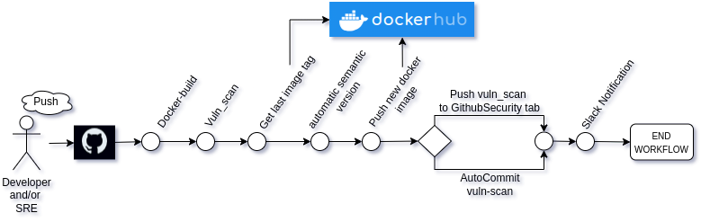
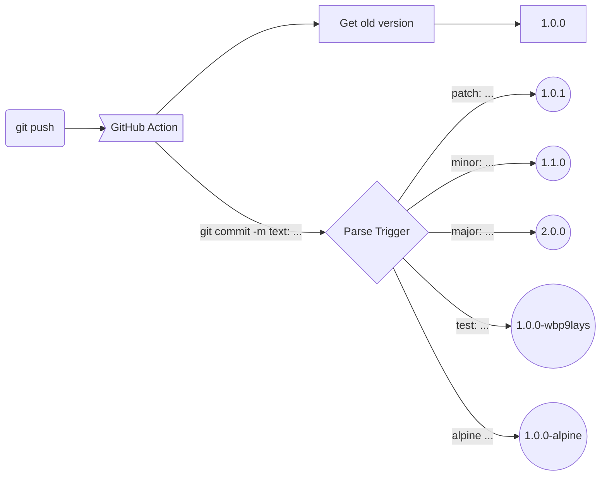
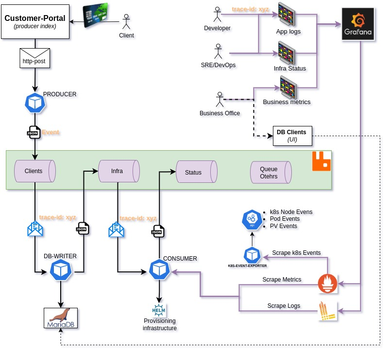
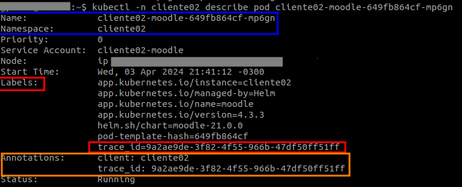
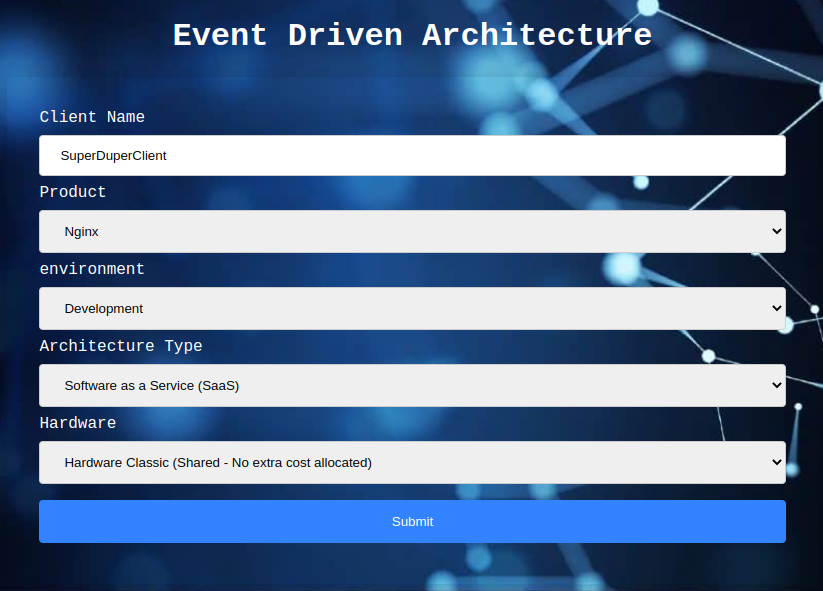
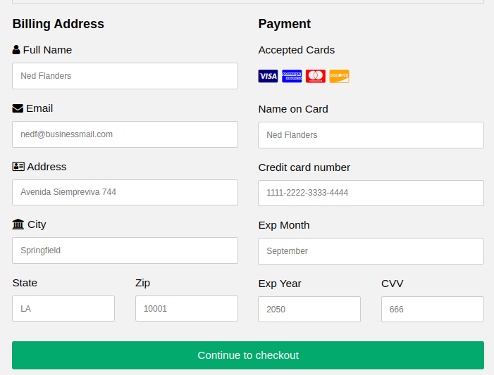
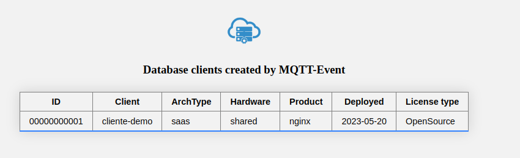
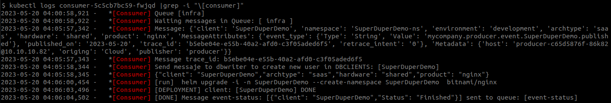
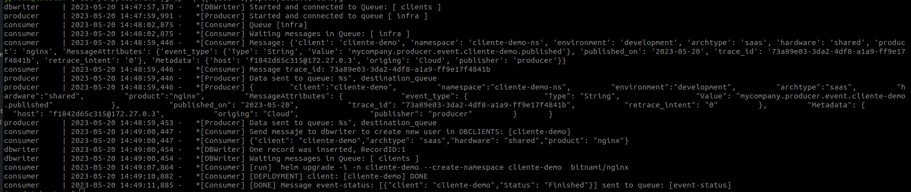
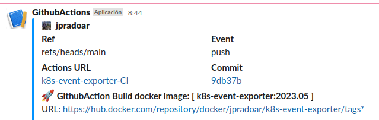

# Event Driven Architecture
### Full Microservices Python Pub/Sub with RabbitMQ

 

:rocket:  <b> Build Status:

</b>

 

 
 
 

### :bulb: My idea
A simple excuse learn and use Python as Pub/Sub and a message broker, in this case RabbitMQ,  to provisioning infrastructure triggered by event like "buy a small module" and finally monitoring all infrastructure.  
I love IoT, for this reason, this PoC is designed to simulate a  "SasS Product".  
At the end of all this, it will provision my small IoT modules. :space_invader:  

 

### :fire: Supposed problem
💀 I need to manage a lot inputs, all of them, will be to do different tasks, like messages, deployments, and more.  Obvioulsly I will re-use data to make another jobs generate custom events, and finally ,will be use Grafana to see some analysis and tendences.
 💀 Some apps have to get information but a common problem is have or develop lot of products in with different technologies like,  NodeJs,Python,Php.
 💀 I would like to have a shared origin to get data and avoid RE-build or make connectors or apis for connect different components in different tech/languages
 💀 All developers need to know what version must be fixed, or I need a human resource to manage version number.  (I would like avoid manage it manually)

 

### :checkered_flag: Objetive
:heavy_check_mark: Create a simple api to centralize all "inputs" and organize work-loads by queues. 
 :heavy_check_mark: Each microservice consume his our queue and if need, can consume others to. 
 :heavy_check_mark: Each microservice do a specific tasks, <b>this is to avoid have "JUMBO-Pods"</b>.
 :heavy_check_mark: All microservice generate logs for future monitoring, analysis and make improvements or troubleshoot.
 :heavy_check_mark: All logs must to be expose in stdout, to avoid write data in the container. This way enable me to use my pods with ReadOnly Filesystem.
 :heavy_check_mark: Automate All tasks via microservice API-CALL environments.
 :heavy_check_mark: Generate a big scalability and security isolating each tasks in small actions/calls.
 :heavy_check_mark: Avoid tech dependences or "human-tech dependence". Each human can enjoy his own Tech/Language  *(...No, no java, please!  :joy: )*.
 :heavy_check_mark: The standard (input/output) will be  [JSON](https://www.json.org/json-en.html) because its an open standard and is easy to implement and easy to parse.
 :heavy_check_mark: To manage version numbers I created a [Semantic Version GithubAction](https://github.com/marketplace/actions/genericsemanticversion)  

### Extra features 
 :heavy_check_mark: <b>Safe data</b>:  My apps use tokens or passwords, and I need to manage them safely and then I need to commit all data without leaking my secrets.   ;) 
 :heavy_check_mark: <b>Vendor lock-in</b>: In my case, I prefer have a infrastructure can be used and implemented in any cloud provider that runs a kubernetes cluster, in an "on-premise" client environment or even in a development environment like my laptop.
 :heavy_check_mark: <b>Vulnerability Scans</b>: Every time a Developer or SRE build a docker image must be scanned to find possible vulnerabilities. If it happen that image have to mark with different tag. [Vulnerability Scans](vuln_scans/) 
 :heavy_check_mark: <b>Monitoring</b>: All developers or devops must be see some metrics.
 
 

### Workflow logic
 

 

### For automatic semantic release logic

# Architecture design
 

 

### Json data model (example)
    {                                              /* Posible Inputs */ 
    "client":"cliente02",                          /* Client Name / Identification */ 
    "namespace":"cliente02",                       /* kubernetes namespace = client */
    "environment":"Development",                   /* Dev / Stage / Prod */
    "archtype":"SaaS",                             /* SaaS / Edge / On-Prem */
    "hardware":"Dedicated",                        /* Classic (No extra cost allocated) / Dedicated (Extra cost allocated) */
    "product":"Product-A",                         /* Product-A / -B / -C / -N */ 
    "MessageAttributes": { 
      "event_type": { 
        "Type": "String",     
        "Value": "mycompany.producer.event.client.published"   /* (Dinamic) Company.App.messageType.client.EventAction */
        }, 
      "published_on": "2023.01.2.23.02.642883101",         /* +%Y.%m.%d.%H.%M.%N */ 
      "trace_id": "9a2ae9de-3f82-4f55-966b-47df50ff51ff",  /* uniq random string  */
      "retrace_intent": "0"                                /* how many reintents */
      }, 
      "Metadata": { 
        "host": "hostname",                       /* microservice */
        "origing": "Cloud",                       /* Cloud / On-Prem */
        "publisher": "producer"                   /* publisherType */
      } 
    } 

### TraceID from deployment workflow to pod annotations
 
 

_This trace_id is super usefull when you need to see the deployment trace, and then I use it like reference tag and/or annotations in pods.
trace_id is generated on first api-call in deployment process and is allocated to all the pods. If you use grafana or similar you can trace all steps and associate it to deployment or even in each pod deployed with this process_

  

### Producer (client portal)
 

 

### DBClients UI (webserver)
 

 

### Kubernetes Logs
 

 

 

### Alerts and Messages
 

 
