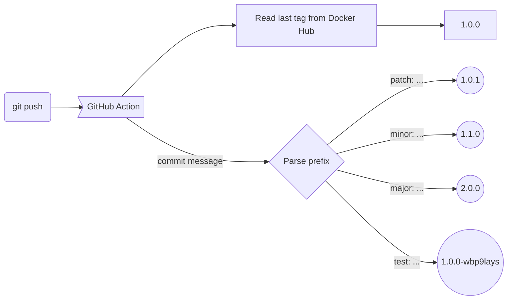

<div align="center">

# A small SaaS laboratory

### An end-to-end event-driven architecture for automated app deployments.

| Link | What you will find |
|---|---|
| [](https://github.com/users/jpradoar/projects/2/views/1) | Full project roadmap: what is done, in progress and pending, with the reasoning behind each item  (Like Jira) |
| [](https://jpradoar.github.io/event-driven-architecture/) | This README as a web page, plus the HTML vulnerability report |
| [](https://jpradoar.github.io/helm-chart/) | My Helm repository. The chart that Ansible deploys lives there |
| [](https://github.com/marketplace/actions/genericsemanticversion) | My GitHub Action on the Marketplace. It computes the next image tag from the commit message |


</div>

<hr>

## What this is

A personal lab to learn and practice event-driven architecture: a web form publishes an event to RabbitMQ, a chain of small Python services consumes it, deploys a Helm release for that "client", stores the record in MariaDB and shows it in a web UI. Everything around it (EC2, Kubernetes, ArgoCD, Grafana, CI, image scanning, versioning) is code.

It is a proof of concept, not a product. There are a few things that are wrong and have not been fixed yet. Do not expose this stack to the internet as is


## Where it comes from

It started as a backend to receive events from home sensors through custom HomeAssistant over MQTT. That is why RabbitMQ has the MQTT plugin enabled and why half of the repo is still named `mqtt-*`. The IoT part never landed; the project mutated into what you see here: an excuse to build the full path from "someone buys a product" to "a workload is running, tracked and monitored".

## Architecture

<div align="center">

</div>

The real flow, service by service:

| # | Service | Tech | Does |
|---|---|---|---|
| 1 | `03-producer` | Python / Flask | Serves the "buy a product" form on port 5000. On submit builds a JSON event with a fresh `trace_id` and publishes it to the `infra` queue. Also publishes a status message to `event-status`. |
| 2 | `04-consumer` | Python | Consumes `infra`. Publishes a reduced message to `clients`, then runs `helm upgrade --install` of a Bitnami chart in a namespace named after the client, stamping the `trace_id` as pod label and annotation. Finally publishes "Finished" to `event-status`. |
| 3 | `05-dbwriter` | Python | Consumes `clients` and inserts the record into the `clients` table in MariaDB. |
| 4 | `06-webserver` | PHP / Apache | Reads the `clients` table and lists every provisioned client. |
| 5 | `12-k8s-event-exporter` | kubectl | Streams cluster events to stdout so they end up in the log pipeline. |
| - | `01-generic-pub_sub` | Python | Template to create a new consumer/producer pair in minutes. |

Broker: RabbitMQ (AMQP 0-9-1 through `pika`, one durable queue per task). Database: MariaDB. Every service exposes a Prometheus `/metrics` endpoint on port 9090 and logs only to stdout.

### Event model

This is the exact payload the producer emits today:

```json
{
  "client": "cliente02",
  "namespace": "cliente02-ns",
  "environment": "Development",
  "archtype": "SaaS",
  "hardware": "Dedicated",
  "product": "Product-A",
  "MessageAttributes": {
    "event_type": { "Type": "String", "Value": "mycompany.<producer-pod>.event.cliente02.published" },
    "published_on": "2025-09-05",
    "trace_id": "9a2ae9de-3f82-4f55-966b-47df50ff51ff",
    "retrace_intent": "0"
  },
  "Metadata": {
    "host": "<producer-pod>@<pod-ip>",
    "origing": "Cloud",
    "publisher": "<producer-pod>"
  }
}
```

Yes, `origing` is a typo, and it is also in the code. `retrace_intent` is reserved for a retry counter that is not implemented yet. Both are on the list.

### One trace_id from the form to the pod

<div align="center">

</div>

The `trace_id` is generated on the first call (the form submit) and travels inside every message. The consumer writes it as a label and annotation on every pod it deploys, so in Grafana or with a plain `kubectl get pods -l trace_id=...` you can follow one purchase across queues, logs and workloads. This is the piece of the lab I use the most when troubleshooting.

## Infrastructure

<div align="center">

</div>

Two blocks, both code:

1. **Base platform**: Terraform creates one EC2 instance (t2.medium, two encrypted gp3 volumes) and a security group. Ansible then installs MicroK8s, Helm, kubectl, ArgoCD, and deploys the application stack from my [Helm chart repository](https://jpradoar.github.io/helm-chart/). ArgoCD is bootstrapped from the [gitops](https://github.com/jpradoar/gitops) repo.
2. **Application stack**: the services above, deployed as a Helm release. The manifests under `Kubernetes/` are the original hand-written version and lag behind the chart; the chart is the source of truth.

## Quick start

### Option A: everything on AWS with one script

Requirements: Terraform 1.9.x, Ansible core 2.17.x with the `community.general` and `kubernetes.core` collections, `jq`, `nc`, an AWS profile named `development` (or edit `terraform/variables.tf`), and a VPC and subnet to deploy into.

```bash
# 1. SSH key used by Terraform and Ansible
ssh-keygen -b 2048 -t rsa -f terraform/kp/demo_sshkey_tf -q -N ''

# 2. Where to deploy
export TF_VAR_vpc_id="vpc-xxxxxxxx"
export TF_VAR_subnet_id="subnet-xxxxxxxx"

# 3. Deploy (terraform apply + wait for SSH + ansible-playbook)
sh run-demo.sh deploy

# 4. Tear down
sh run-demo.sh delete
```

<br>

### Kubernetes Logs
<br>

<br>

<br>

### Alerts and Messages
<br>

<br>


When the playbook finishes it prints the public endpoints. On the EC2 host, for the demo only, they are exposed with `kubectl port-forward` on `0.0.0.0`:

| Port | Service |
|---|---|
| 5000 | Producer (the form) |
| 8080 | Webserver (clients list) |
| 3000 | Grafana |
| 15672 | RabbitMQ management |
| 8081 | ArgoCD |

Feature flags live at the top of `ansible/main.yaml`: `ENABLE_EDA_STACK`, `ENABLE_ARGOCD`, `OPEN_PORT_FOR_DEMO`, `SEND_NOTIFICATIONS`.

### Option B: the application only, on your laptop

```bash
cd docker-compose
docker compose up -d
```

Producer on http://localhost:5000, webserver on http://localhost:8080, RabbitMQ management on http://localhost:15672. Credentials are in the compose file. This option runs the message flow and the database, but not the Helm deployment step (there is no cluster).

## CI, versioning and image scanning

<div align="center">

</div>

Each service has its own GitHub Actions workflow, triggered only when its folder changes. Every run:

1. Reads the latest tag from Docker Hub.
2. Computes the next version with my [Semantic Version GitHub Action](https://github.com/marketplace/actions/genericsemanticversion), driven by the commit message prefix.
3. Builds and pushes the image.
4. Scans it with Trivy (vulnerabilities, secrets, misconfigurations, licenses). The report is committed to [`vuln_scans/`](vuln_scans/) and, if CRITICAL findings exist, a GitHub issue is opened and Slack is notified.


```mermaid
graph LR
    A(git push) --> B>GitHub Action]
    B --> C[Read last tag from Docker Hub]
    C --> D[1.0.0]
    B --> | commit message | E{Parse prefix}
    E --> |patch: ...| F((1.0.1))
    E --> |minor: ...| G((1.1.0))
    E --> |major: ...| H((2.0.0))
    E --> |test: ... | I((1.0.0-wbp9lays))
```

Terraform has its own pipeline: `validate`, `fmt`, `tfsec` and a real `apply` against [LocalStack](localstack/), so the code is exercised on every pull request without touching AWS.

## Repository layout

```
01-generic-pub_sub/   template for new services
02-customer-portal/   static landing page (nginx)
03-producer/          Flask form -> RabbitMQ
04-consumer/          RabbitMQ -> helm deploy
05-dbwriter/          RabbitMQ -> MariaDB
06-webserver/         PHP UI over the clients table
11-jobs/              Kubernetes Jobs (Slack notifications)
12-k8s-event-exporter/
Kubernetes/           original manifests (see note above)
docker-compose/       local run
terraform/            EC2 + security group
ansible/              MicroK8s, Helm, ArgoCD, app stack
localstack/           fake AWS for the Terraform pipeline
monitoring/           Grafana values and dashboards
vuln_scans/           Trivy reports committed by CI
c2w/                  "code to work": self-hosted runner and dev container
deb_packages/         side exercise: building .deb packages with lintian and trivy
```


## License

MIT. See [LICENSE](LICENSE).
