

# Event Driven Architecture

### 🏠 A small SaaS project for IoT

 

:rocket:  <b> Build Status and info project:

</b>

 

 
 
 

    
|Link | Desc |
|---|---|
|Project (summary)|[https://jpradoar.github.io/event-driven-architecture/](https://jpradoar.github.io/event-driven-architecture/)|
|   |Here you can see the full project roadmap and more info  |
|   |Personal Helm repo   |
|   |My own semantic version GitHub Action  |
|Github|[https://github.com/jpradoar/event-driven-architecture/](https://github.com/jpradoar/event-driven-architecture/)|

<b></b>   
    

  

### :bulb: My idea
A simple excuse to learn and use Python as Pub/Sub with a message broker, in this case RabbitMQ, to provision infrastructure triggered by events like "buy a small module" and, finally, to monitor all that infrastructure.  
I love IoT. For this reason, this PoC is designed to simulate a "SaaS product".  
At the end of all this, it will provision my small IoT modules. :space_invader:  

 

### :fire: Supposed problem
💀 I need to manage a lot of inputs, and each of them will trigger different tasks, like messages, deployments, and more. Obviously I will reuse that data so other jobs can generate custom events, and finally I will use Grafana for analysis and trends.
 💀 Some apps have to get information, but a common problem is having or developing a lot of products with different technologies, like Node.js, Python or PHP.
 💀 I would like to have a shared source of data, to avoid rebuilding or writing connectors or APIs to connect components written in different technologies/languages.
 💀 All developers need to know which version must be fixed, or I need a person to manage the version numbers. (I would like to avoid managing them manually.)

 

### :checkered_flag: Objective
:heavy_check_mark: Create a simple API to centralize all "inputs" and organize workloads by queues. 
 :heavy_check_mark: Each microservice consumes its own queue and, if needed, can consume others too. 
 :heavy_check_mark: Each microservice does a specific task, <b>to avoid having "JUMBO-Pods"</b>.
 :heavy_check_mark: All microservices generate logs for future monitoring, analysis, improvements and troubleshooting.
 :heavy_check_mark: All logs must be exposed on stdout, to avoid writing data inside the container. This lets me run my pods with a read-only filesystem.
 :heavy_check_mark: Automate all tasks via API calls between microservices.
 :heavy_check_mark: Gain scalability and security by isolating each task in small actions/calls.
 :heavy_check_mark: Avoid tech dependencies or "human-tech dependence". Everyone can enjoy their own tech/language  *(...No, no Java, please!  :joy: )*.
 :heavy_check_mark: The standard (input/output) will be  [JSON](https://www.json.org/json-en.html) because it is an open standard and is easy to implement and parse.
 :heavy_check_mark: To manage version numbers I created a [Semantic Version GitHub Action](https://github.com/marketplace/actions/genericsemanticversion)  

### Extra features 
 :heavy_check_mark: <b>Safe data</b>:  My apps use tokens and passwords. I need to manage them safely and commit all the code without leaking my secrets.   ;) 
 :heavy_check_mark: <b>Vendor lock-in</b>: In my case, I prefer an infrastructure that can be used and implemented in any cloud provider that runs a Kubernetes cluster, in an "on-premise" client environment, or even in a development environment like my laptop.
 :heavy_check_mark: <b>Vulnerability Scans</b>: Every time a developer or SRE builds a Docker image, it must be scanned to find possible vulnerabilities. If any are found, that image has to be marked with a different tag. [Vulnerability Scans](vuln_scans/)  and  [HTML format](https://jpradoar.github.io/event-driven-architecture/vuln_scans/vuln_scan_demo.html)
 :heavy_check_mark: <b>Monitoring</b>: All developers and DevOps engineers must be able to see some metrics.
 
 

### Infrastructure design and workflow

 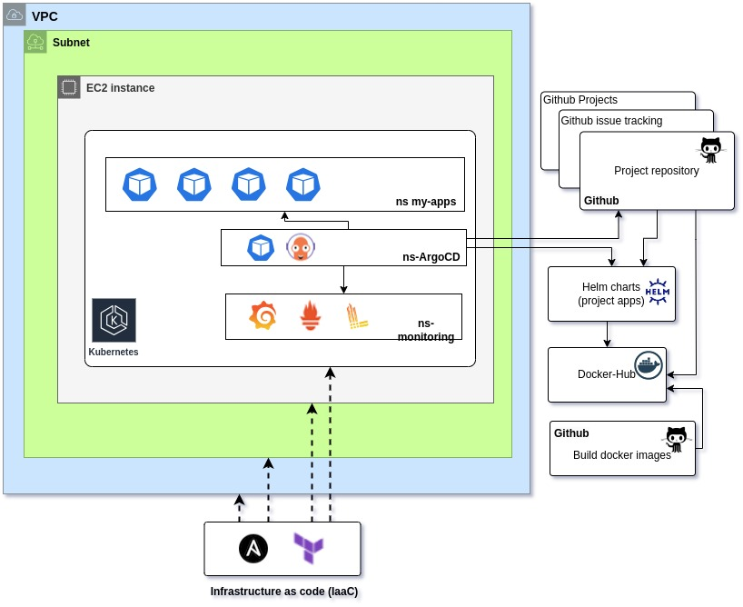
 
 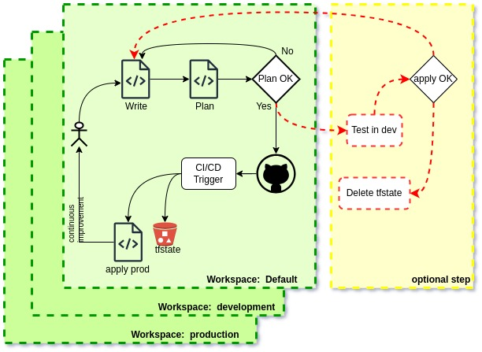

  

### Docker workflows logic
 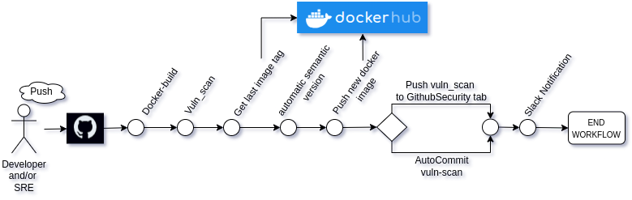

 

### For automatic semantic release logic
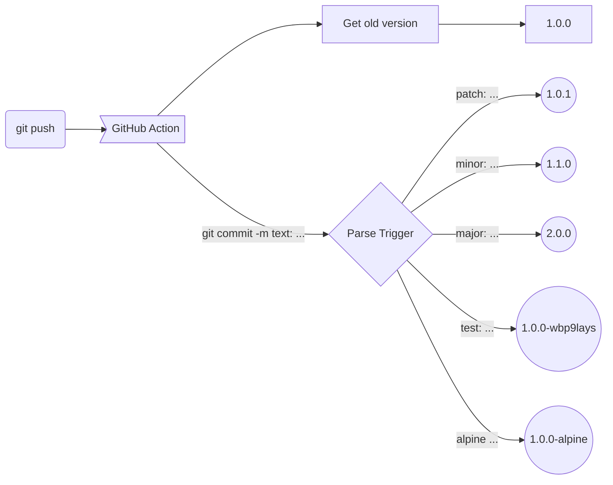
```mermaid
graph LR
    A(git push) --> B>GitHub Action]
    B --> C[Get old version ]
    C --> D[1.0.0]
    B --> | git commit -m text: ...| E{Parse Trigger}
    E --> |patch: ...| F((1.0.1))
    E --> |minor: ...| G((1.1.0))
    E --> |major: ...| H((2.0.0))
    E --> |test: ... | I((1.0.0-wbp9lays))
    E --> |alpine ...| J((1.0.0-alpine))

```

# Architecture design
 
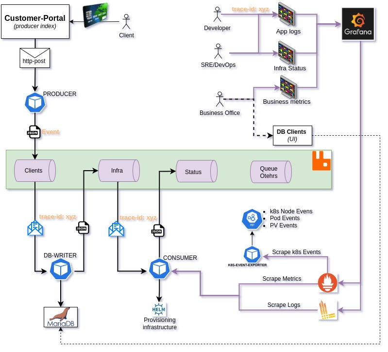

 

### JSON data model (example)
    {                                              /* Possible inputs */ 
    "client":"cliente02",                          /* Client name / identification */ 
    "namespace":"cliente02",                       /* Kubernetes namespace = client */
    "environment":"Development",                   /* Dev / Stage / Prod */
    "archtype":"SaaS",                             /* SaaS / Edge / On-Prem */
    "hardware":"Dedicated",                        /* Classic (No extra cost allocated) / Dedicated (Extra cost allocated) */
    "product":"Product-A",                         /* Product-A / -B / -C / -N */ 
    "MessageAttributes": { 
      "event_type": { 
        "Type": "String",     
        "Value": "mycompany.producer.event.client.published"   /* (Dynamic) Company.App.messageType.client.EventAction */
        }, 
      "published_on": "2023.01.2.23.02.642883101",         /* +%Y.%m.%d.%H.%M.%N */ 
      "trace_id": "9a2ae9de-3f82-4f55-966b-47df50ff51ff",  /* unique random string  */
      "retrace_intent": "0"                                /* how many retries */
      }, 
      "Metadata": { 
        "host": "hostname",                       /* microservice */
        "origing": "Cloud",                       /* Cloud / On-Prem */
        "publisher": "producer"                   /* publisherType */
      } 
    } 

### TraceID from deployment workflow to pod annotations
 
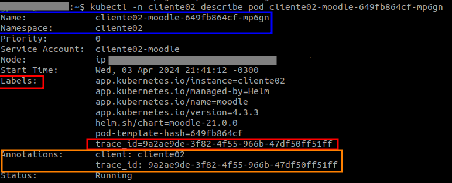 

_This trace_id is super useful when you need to see the deployment trace, and I also use it as a reference tag and/or annotation in pods.
The trace_id is generated on the first API call of the deployment process and is attached to all the pods. If you use Grafana or similar, you can trace all the steps and associate them with the deployment, or even with each pod deployed by this process._

  

### Producer (client portal)
 
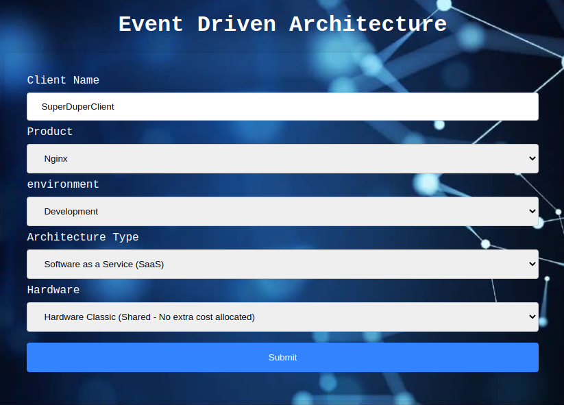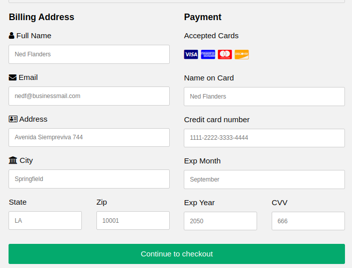
 

### DBClients UI (webserver)
 
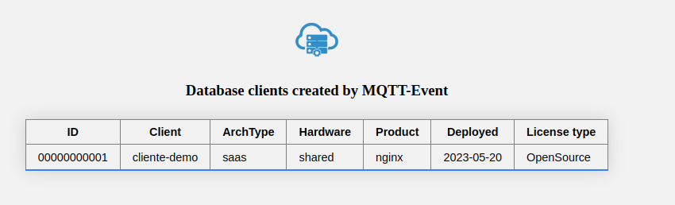
 

### Kubernetes Logs
 
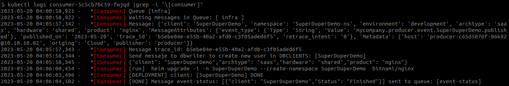
 
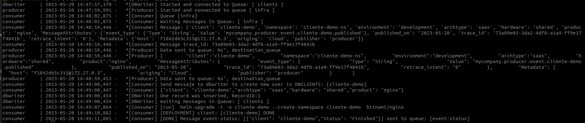
 

### Alerts and Messages
 
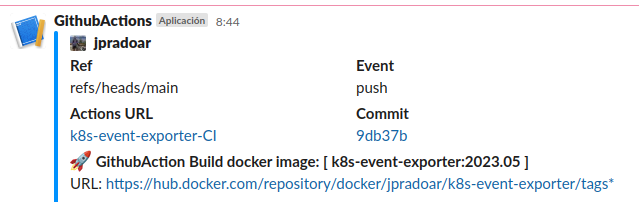
 
